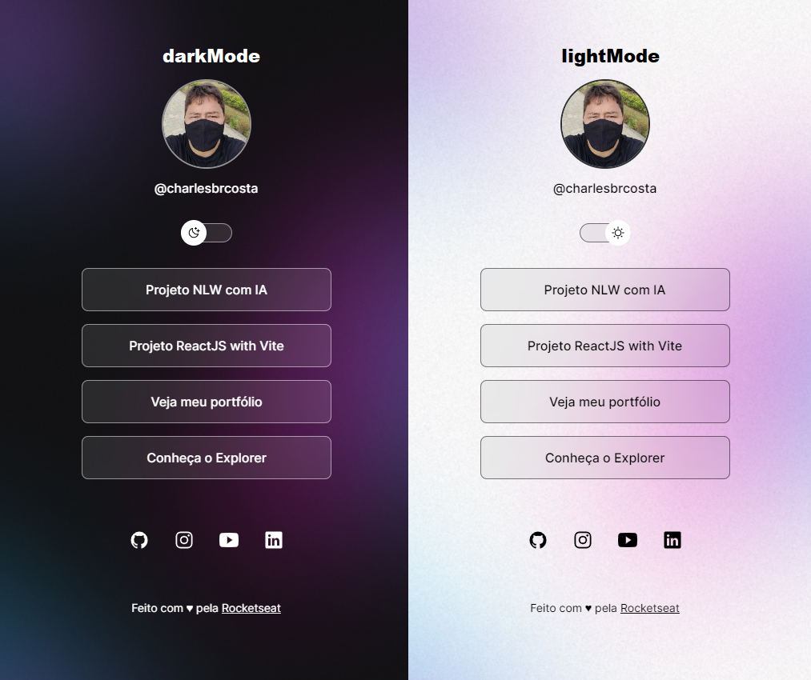

# darkMode e lightMode - localStorage

## Tecnologias utilizadas

<h3>O projeto <strong>devlinks</strong> tem como objetivo, mostrar um pouco sobre o conceito de darkMode, lightMode e localStorage.</h3>
<h3>O devlinks foi dividido em três partes: </h3>

- `index.html` : fica a estrutura (visual) do projeto;
- `style.css` : toda a parte de estilização (cor, formatação etc.);
- `script.js` : regra da funcionalidade para o darkMode, lightMode e localStorage

<h3>Funcionamento do projeto devlinks</h4>

Para a visualização e o funcionamento do projeto <strong>devlinks</strong>, basta abrir o arquivo index.html. Caso esteja utilizado o Visual Studio Code, você pode instalar a <strong>extensão live server;</strong> após a instalação, clique com o botão direito em cima do <strong>index.html</strong> e escolha a opção <strong>Open with live server, para abrir o projeto devlinks</strong>

<h3>GitHub Page</h3>

Acesse o projeto devlinks por meio do link clicando [aqui](https://charlesbrcosta.github.io/devlinks)

<h3>Tela do devlinks</h3>

